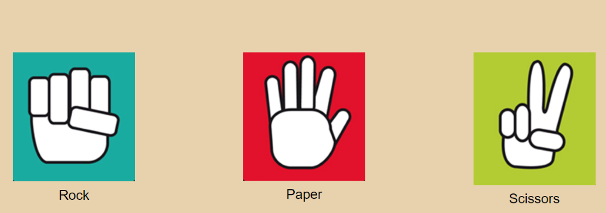

### Projects 

[Android Mobile App](https://github.com/thedavidang/CSC4151)
- Built and design a budget tracking mobile application
- Utilized HelloCharts library to display spending data in a line and pie chart 
- made with Android Studio and Kotlin
 

[Rock, Paper, Scissors game](https://github.com/jasond299/rock_paper_scissors)
- A Rock Paper Scissors game implemented with HTML, CSS, and Javascript
 

[Booking Application](https://github.com/jasond299/Booking-application)
- A simple booking application
- Booking page for users to book and choose rooms and a checkout page to display total cost  
- made with QT and C++
 

