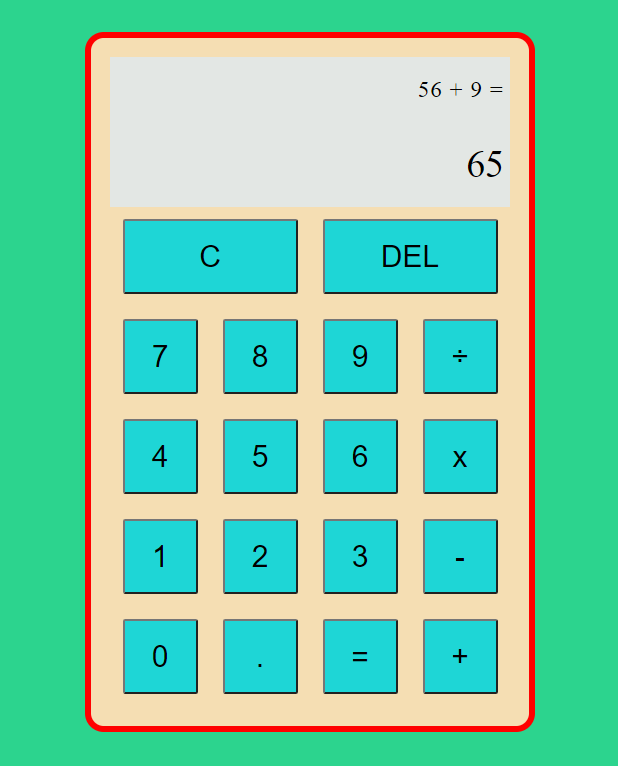

### Projects 

[Android Mobile App](https://github.com/thedavidang/CSC4151)
- A budget tracking mobile application to keep track of spending and expenses
- Utilized HelloCharts library to display spending data in a line and pie chart 
- made with Android Studio and Kotlin
 

[Calculator App](https://github.com/jasond299/calculator_app)
- Calculator application
- made with HTML,CSS, Vanilla JS
 

[Rock, Paper, Scissors game](https://github.com/jasond299/rock_paper_scissors)
- A Rock Paper Scissors game implemented with HTML, CSS, and Javascript
 

