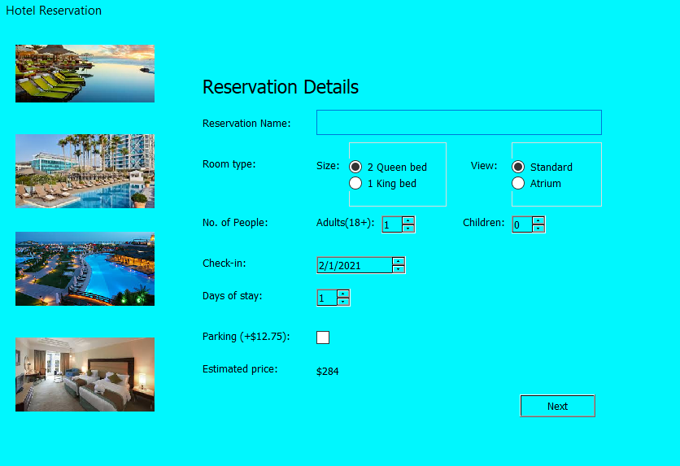
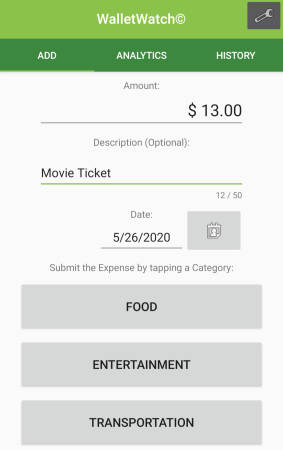
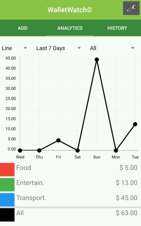
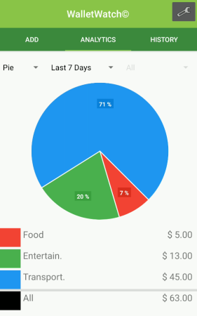

## Portfolio

---

### Projects 

[Booking Application](https://github.com/jasond299/Booking-application)
- A simple booking application
- Booking page for users to book and choose rooms and a checkout page to display total cost  
- made with QT and C++
 

[Android Mobile App](https://github.com/thedavidang/CSC4151)
- Budget tracking app to help and manage your expenses
- Add expenses quickly and view your spending data on diffirent categories in a visualize chart 
- Completely offline, does not store any private and sensitive information
- Team of 4 members
- made with Android Studio and Kotlin
 

